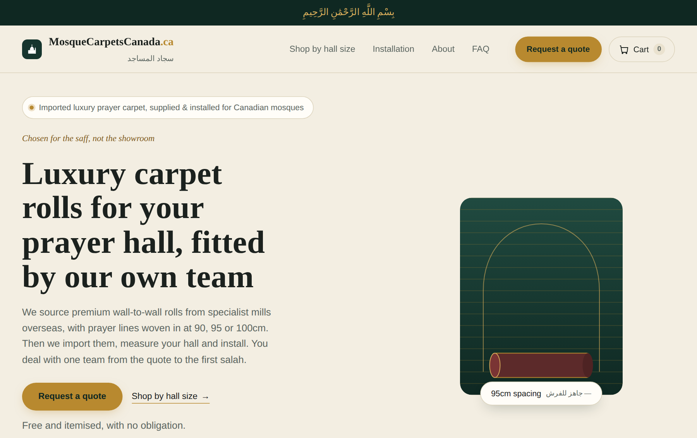
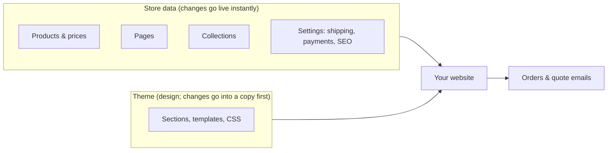
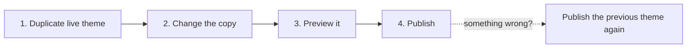
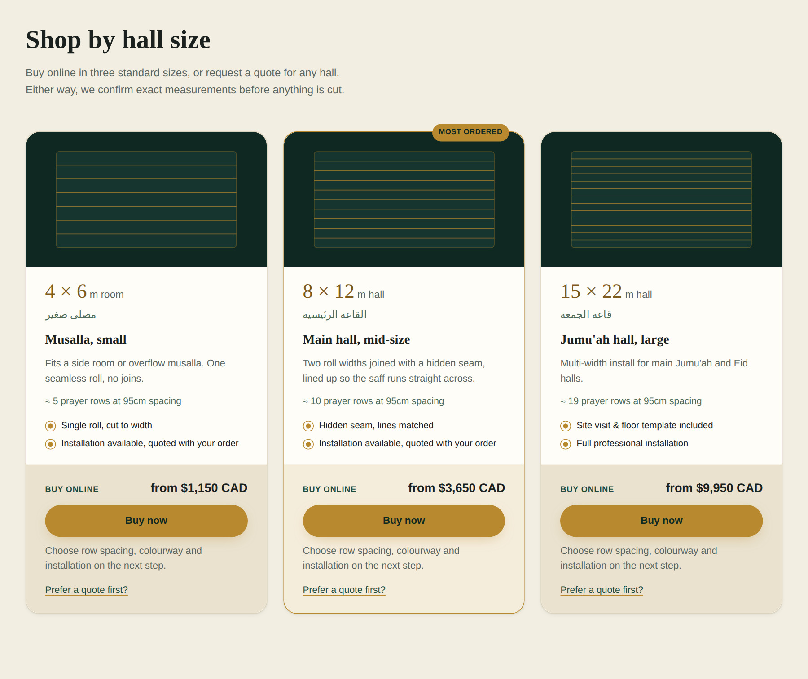
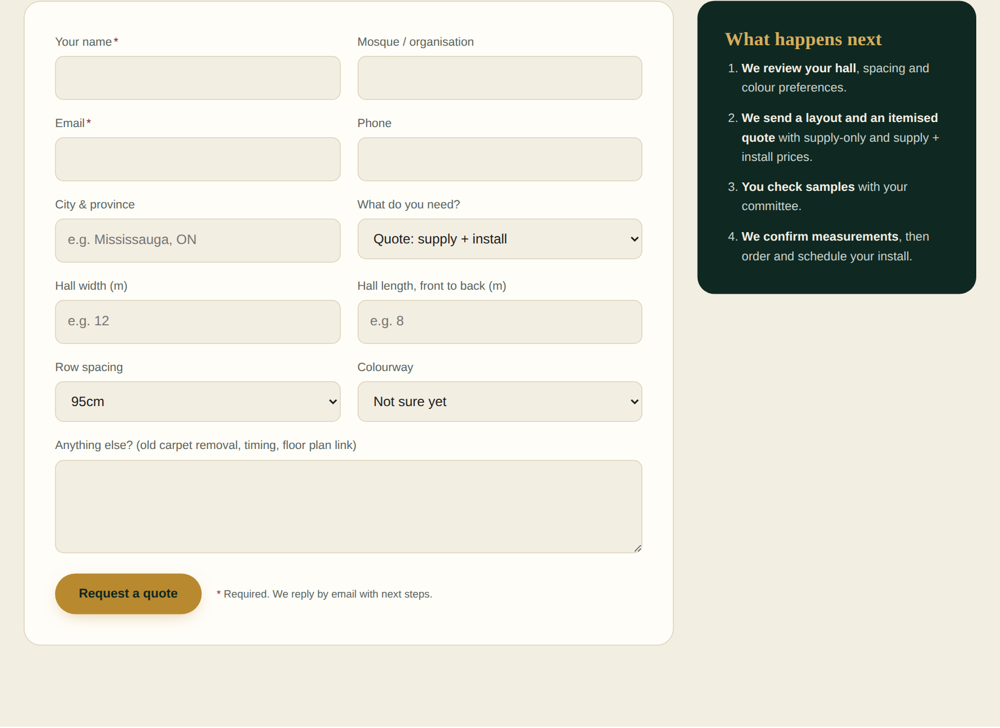
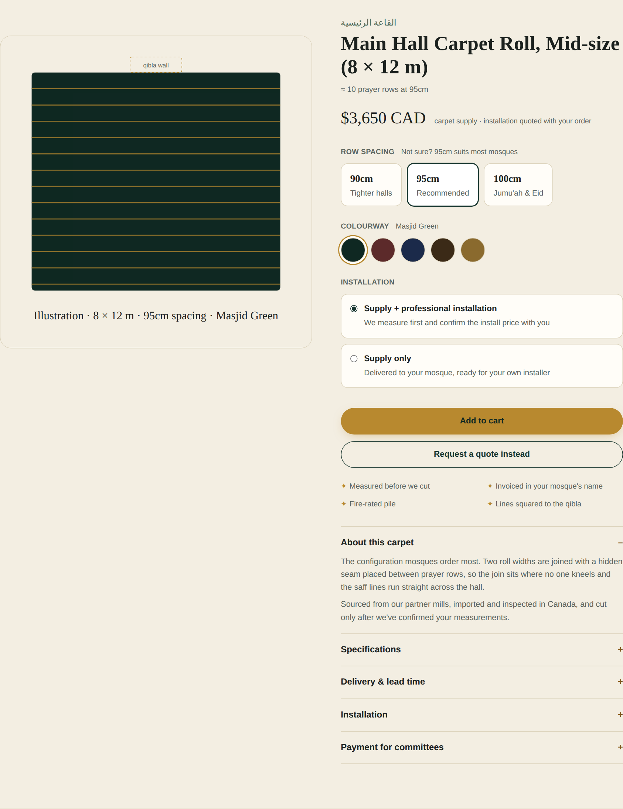
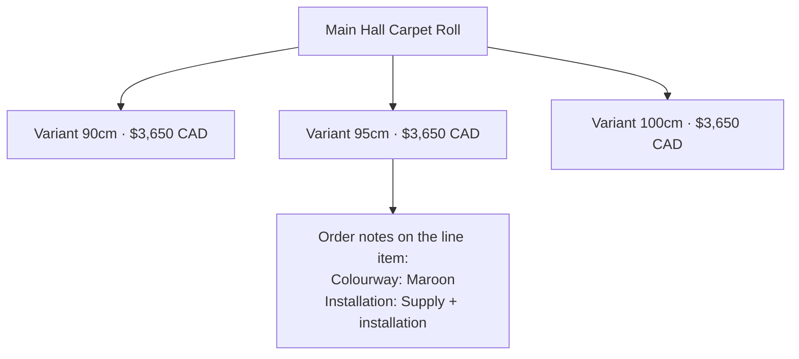

# MosqueCarpetsCanada.ca Shopify Manual

Updated Oct 3, 2026 · Prepared for the owner of MosqueCarpetsCanada.ca

> Also available as a shared doc you can comment on: https://claude.ai/code/artifact/eb627c8a-e3e5-4392-80a4-9d5c2b1bc755

## Start here

Your store now has a custom design, three products on sale, a working quote form and four public pages. Two things still need you before real customers order: shipping rates and payments (see Urgent setup).



*The live homepage (Site update v3), top of the page.*

This manual explains what was changed, how to do the same things yourself in Shopify admin, and the few Shopify ideas that trip people up. Every change was previewed in chat and approved by you before it touched the live store.

**Your store at a glance**

| Item | Now |
| --- | --- |
| Admin address | admin.shopify.com, store tqtwwj-3a |
| Plan, currency | Basic, CAD, ships to Canada only |
| Live theme | MosqueCarpetsCanada — Site update v3 (detail pass) |
| Password page | On: only people with the password can see the store |
| Products | 3 hall-size carpet rolls, Active, on the Online Store |
| Pages | Installation, About Us, Request a quote |
| Collection | Prayer hall carpet rolls |

**What was done, newest first**

| Date | Change | Where it lives |
| --- | --- | --- |
| Oct 3 | Hall-size slider (arrows, motion blur, pop-out buy panel) built into Site update v5 (carousel), ready for you to publish | Online Store → Themes |
| Oct 3 | You published Site update v4 (buy panels): Buy now panels are live | Online Store → Themes |
| Oct 1 | Hall-size cards got a Buy now panel (preview) | Repo: theme/sections/mosque-home.liquid |
| Oct 1 | Store homepage given a Google title and description | Online Store → Preferences |
| Oct 1 | Collection Prayer hall carpet rolls created (fills itself) | Products → Collections |
| Oct 1 | 3 products rewritten, given Google listings, set Active and published | Products |
| Oct 1 | Installation page created, About Us published, Contact renamed Request a quote | Online Store → Pages |
| Oct 1 | You published Site update v3 | Online Store → Themes |
| Sep 30 | Detail pass: readable colours, sticky header, one button style, image slots, mobile quote bar | Theme Site update v3 |
| Sep 30 | You published Site update v2 | Online Store → Themes |
| Sep 30 | New homepage sections, product page, Installation, About and quote page designs | Theme Site update v2 |
| Sep 30 | Shopify and design reference skills added to the project repo | GitHub repo, .claude/skills |

## How your store fits together



Products, pages and settings are data: edit them and the site changes at once. The theme decides how that data looks; its changes go into a copy first and reach customers only when you press Publish.

## Themes: live and unpublished copies

A theme is the design of your site. Only one theme is live at a time; every other theme is a private copy you can preview and change without customers seeing it. That is why every design change was built in a fresh copy and you pressed Publish yourself.



**Your themes today**

| Theme | Role | Keep? |
| --- | --- | --- |
| Site update v5 (carousel) | Unpublished | Publish this to put the hall-size slider live |
| Site update v4 (buy panels) | Live | Yes, this is your site (your fallback after v5 goes live) |
| Site update v3 (detail pass) | Unpublished | Yes, older fallback |
| Site update v2 | Unpublished | Yes, your one-click fallback |
| Hero spacing | Unpublished | Optional: the design before v2 |
| Design, Updated copy of Design, Fix colorways, Artistry carousel | Unpublished | Safe to delete once you're happy |
| Horizon | Unpublished | Shopify's plain starting theme; safe to delete |

**Preview a copy before publishing**

1. In Shopify admin, open **Online Store → Themes**.
2. Find the copy under **Theme library**, click the **⋯** menu, then **Preview**.
3. Click through the homepage, a product, Installation, About and Request a quote. Check on your phone too: the preview bar has a share link.

**Publish a copy**

1. Same **⋯** menu → **Publish** → confirm.
2. Customers see it within a minute. The old live theme drops into the library, unchanged.

**Roll back if something looks wrong**

1. Open **Online Store → Themes**, find the previous theme (for example Site update v2).
2. **⋯** → **Publish**. You are back where you were. Nothing is lost.

Why I never edit the live theme: the connection I use blocks writes to a live theme, and that rule protects you. A half-finished edit can never appear in front of customers.

## Changing wording yourself

Most wording on the site can be changed in the theme editor without code. Changes save to that theme only, so try them in an unpublished copy first if you're unsure.

1. Open **Online Store → Themes** and click **Customize** on the theme.
2. Use the page picker at the top to choose **Home page**, **Products**, or a page (Installation, About Us, Request a quote).
3. In the left sidebar, click the section, for example **Mosque carpet home**. Its settings open.
4. Edit the text box. The preview on the right updates as you type.
5. Click **Save** (top right). On the live theme, customers see it straight away.

**What you can change, and where**

| Section in the editor | Settings you'll find |
| --- | --- |
| Mosque carpet home | Hero badge, kicker, heading and text; the 3 stats; fire rating and payment lines; Shop by hall size heading; sourcing photo and text; lead time; service area; testimonial; closing banner; note under quote buttons |
| Hall size card (blocks inside the home section) | Dimensions, Arabic label, title, description, two “included” lines, rows line, Most ordered tag, linked product |
| FAQ item (blocks inside the home section) | Question and answer; drag to reorder, or add and remove items |
| Mosque product page | Note beside the price, pile, fire rating, delivery and payment text (shared by all products) |
| Installation page | Heading, intro, service area |
| About page | Heading, intro, a line about who runs the business |
| Quote request | Heading, intro, phone or WhatsApp line |
| Mosque footer | Tagline, phone |

**Not in the editor:** the menu links in the header and footer, button labels, and the page layouts. Those are in the theme's code, so ask me and I'll change them in a copy for you to preview.

**Add the testimonial:** Home page → Mosque carpet home → Testimonial → type the quote and attribution → Save. The section only appears once the quote box has text.

## Products

Your 3 products are Active, published to the Online Store, and orderable at any row spacing. Each one has the same price for 90, 95 and 100cm.

| Product | Price | Row spacing options | Tags the site relies on |
| --- | --- | --- | --- |
| Musalla Carpet Roll — Small (4 × 6 m) | $1,150 CAD | 90, 95, 100cm | musalla |
| Main Hall Carpet Roll — Mid-size (8 × 12 m) | $3,650 CAD | 90, 95, 100cm | main-hall |
| Jumu'ah Hall Carpet Roll — Large (15 × 22 m) | $9,950 CAD | 90, 95, 100cm | jumuah |



*The hall-size cards with the new Buy now panels. Approved and built into Site update v4 (buy panels); live once you publish that theme.*

**Keep these tags.** The product page uses them to show the Arabic hall name, the coverage in square metres and the rows line. A product without one of these tags still works, it just shows less.

**Edit a description or price**

1. **Products** → click the product.
2. Change **Description**. To change a price, scroll to **Variants**, click a row spacing, change **Price**, then Save.
3. Click **Save**. The site updates straight away.

**Add photos**

1. **Products** → the product → **Media** → **Add files**.
2. Drag the best installed-hall photo to the first position: it appears on the homepage card and as the main product image.
3. Click each photo → **Add alt text** (one plain sentence describing the photo). See PHOTO-GUIDE.md in the repo for the shot list.

Until photos exist, the site shows matching drawings of each hall layout instead of empty boxes.

**Stop or start sales**

| You want | Do this |
| --- | --- |
| Hide a product completely | Product → **Status** → Draft |
| Keep it visible but not buyable | Variants → each → tick **Track quantity**, set 0, untick **Continue selling when out of stock**. The page shows “Currently unavailable” and the quote button still works |
| Retire it for good | Status → Archived |

Stock is not tracked today, which is why all three show as available whatever the quantity says.

## Collections

The collection Prayer hall carpet rolls (address: /collections/prayer-hall-carpet-rolls) holds all 3 products, cheapest first. It is a smart collection: you never add products to it by hand.

Its one rule is **Product type is equal to Prayer Hall Carpet Roll**. Any product with that exact type joins automatically, and leaves if the type changes.

**Add a new size to it:** when creating the product, type `Prayer Hall Carpet Roll` in **Product organization → Type**, spelled exactly, then Save.

**Change the order:** Products → Collections → Prayer hall carpet rolls → **Sort** (price, title, best selling, or manual).

A manual collection is the other kind: you tick products in and out yourself. Use one for hand-picked groups, such as a seasonal Ramadan offer.

## Pages and the quote form

You have 3 public pages. Each one's design comes from a template in the theme, and each page record only holds its title, address and Google listing.

| Page | Address | Template | What fills it |
| --- | --- | --- | --- |
| Installation | /pages/installation | installation | Install-day steps, supply vs supply + install, committee checklist |
| About Us | /pages/about | about | Why we source rather than make, what we promise |
| Request a quote | /pages/contact | contact | The quote form |

**Keep the addresses.** The header, footer and buttons link to /pages/installation, /pages/about and /pages/contact. If you change a page's handle (its URL) in admin, those links break. Change the title freely; leave the handle alone.

**Where quote requests go**

A submitted quote form arrives as an email at the store's contact address, currently your personal Gmail. Each email lists the name, mosque, email, phone, city, request type, hall width and length, row spacing, colourway and message. To send them elsewhere, change **Settings → Store details → Store contact email**.



*The quote form. Fields marked \* are required; everything else helps you quote faster.*

The calculator, sample links and “Prefer a quote first?” links fill parts of the form in for the customer, so most requests arrive with the hall size already typed in.

**Add your own words to a page:** Online Store → Pages → the page → type in **Content** → Save. On Installation and About it appears under the opening paragraph.

## Google listings (SEO)

Every page and product now has its own search title and description, the two lines Google shows in results. Google can only show them once the password page is off.

| Where | Search title |
| --- | --- |
| Homepage | Luxury Prayer Hall Carpet, Supplied & Installed \| MosqueCarpetsCanada.ca |
| Installation | Prayer Hall Carpet Installation \| MosqueCarpetsCanada.ca |
| About Us | About Us \| MosqueCarpetsCanada.ca |
| Request a quote | Request a Quote \| MosqueCarpetsCanada.ca |
| Each product | e.g. Main Hall Prayer Carpet Roll, Mid-size (8 × 12 m) \| MosqueCarpetsCanada.ca |

**Edit one:** open the product or page, scroll to **Search engine listing**, click the pencil, change the title (under about 60 characters) or description (under about 160) → Save. The homepage's is in **Online Store → Preferences**.

The store name still reads “My Store” in browser tabs and emails. Change it in **Settings → Store details**.

## Orders

A carpet order tells you the size, the row spacing, the colourway and whether the customer wants installation. Size and spacing are part of the product; colourway and installation appear as notes under the line item.



*Where the order details come from: row spacing (a variant), then colourway and installation (order notes), then Add to cart.*

**What a line item looks like in Orders**

```
Main Hall Carpet Roll — Mid-size (8 × 12 m)
95cm                                   $3,650.00 × 1
  Colourway: Maroon
  Installation: Supply + installation
```

**Handling a new order**

1. **Orders** → click the order number.
2. Read the two notes under the item. “Supply + installation” means you contact the customer to measure and price the install before cutting.
3. Reply to the customer using the email on the order. Confirm measurements, delivery window and any install price.
4. When the roll ships or is installed, click **Mark as fulfilled**. Add tracking if a carrier delivers it.

The Jumu'ah hall size includes a site visit and floor template in its price, so book that visit first.

## Urgent setup before you launch

Fix shipping, then payments, place a test order, and only then remove the password. Today anyone with the password can buy a $9,950 roll and choose free or $12 shipping.

**1. Shipping: give carpet rolls their own rates**

Your checkout uses Shopify's default rates: $12 Standard, a free Standard option and $20 Express, Canada only. Carpet rolls need their own shipping profile so these small-parcel rates never apply to them.

1. **Settings → Shipping and delivery → Create new profile** (under Custom shipping rates). Name it Carpet rolls.
2. **Add products** → tick the 3 carpet rolls → Done.
3. Under **Shipping zones**, create a zone named Canada (or only the provinces you serve).
4. **Add rate**, depending on your choice:

| Your choice | Rate to add |
| --- | --- |
| A. Delivery included in the price | Name: Delivery & installation scheduled after order · Price: $0 |
| B. Flat fee per roll | Name: Freight delivery · Price: your fee |
| C. Quoted after the order | Name: Delivery quoted by email after order · Price: $0, and say so in your order confirmation |

5. Save. Delete the $0 Standard rate from the General profile if you never want free shipping on anything.

**2. Payments**

1. **Settings → Payments.** Activate **Shopify Payments** to take cards (it needs your business and bank details).
2. For committees: **Manual payment methods → Create custom payment method**, name it Purchase order or bank transfer, and write the instructions (who to pay, account details, PO email). Orders placed this way show as Payment pending until you mark them paid.

**3. Test order**

Turn on **test mode** in Shopify Payments, place an order for the small roll with a test card, check the email and the order notes, then cancel and refund it. Turn test mode off.

**4. Remove the password**

**Online Store → Preferences → Password protection** → untick **Restrict access** → Save. The store is now public and Google can start listing it.

## The trickier Shopify ideas, explained

### Store data versus theme code

Shopify keeps two separate things: your store data (products, prices, pages, orders, settings) and your theme (the code that decides how that data looks). Changing a product description is instant and needs no theme work. Changing a button, a layout or the menu means changing the theme, which is why those go through an unpublished copy and a Publish click.

Rule of thumb: if you can change it in Products, Pages or Settings, it's data. If it's about where things sit or what a button says, it's the theme.

### Variants versus order notes

A variant is a version of a product that Shopify treats as its own item, with its own price and stock count. Row spacing is a variant: 90, 95 and 100cm.

Colourway and installation are not variants. They travel with the order as notes (Shopify calls them line-item properties). This keeps each product to 3 variants instead of 30 (3 spacings × 5 colours × 2 installation choices). The trade-off: Shopify can't count stock per colour or charge more for one colour. If colours ever differ in price or stock, they should become variants; ask me and I'll convert them.



### Active is not the same as visible

A product needs two things to appear on the site: **Status: Active**, and the **Online Store** sales channel ticked under Publishing. A product can be Active but missing from the Online Store, and it won't show. Both are set on your 3 products.

### Why the menus in Navigation don't change the site

**Online Store → Navigation** holds menus, but your custom header and footer don't read them: their links are written into the theme. Editing the Main menu there changes nothing. To change header or footer links, ask me for a theme copy.

### The password page on a paid plan

On a paid plan the password only blocks browsing. Anyone you give it to can still add to cart and check out, and their order is real if a payment method is active. Treat the password as a curtain, not a lock.

### Page addresses (handles) and templates

Every page and product has a handle, the last part of its address (/pages/**installation**). The site's links point at handles, so renaming a title is safe but changing a handle breaks links. A page's **Template** setting picks which design it uses: Installation uses the installation template, and so on.

## Troubleshooting

| You see | Likely cause | Fix |
| --- | --- | --- |
| An old design after publishing | Your browser cached the page, or you opened an old preview link | Refresh with Ctrl+Shift+R (Cmd+Shift+R on a Mac), or open the plain store address |
| “Page not found” on Installation or About | The page was unpublished or its handle changed | Online Store → Pages → the page → Visible, and handle installation or about |
| A hall-size card opens the catalogue, not the product | The product is Draft, or not on the Online Store | Set Status Active and tick Online Store under Publishing |
| A product is missing from the collection | Its Product type isn't exactly Prayer Hall Carpet Roll | Fix the spelling in Product organization → Type |
| Product page shows no Arabic name or coverage | The size tag (musalla, main-hall, jumuah) was removed | Add the tag back |
| Menu edits in Navigation do nothing | The header and footer links live in the theme | Ask for a theme change |
| Quote form emails don't arrive | Store contact email is wrong or filtered as spam | Check Settings → Store details, and the spam folder |
| Price shows “Currently unavailable” | Stock tracking is on with 0 in stock | Untick Track quantity, or add stock |

If something looks broken after a theme publish, publish the previous theme to roll back (see Themes), then tell me what you saw.

## Still open

These need a decision or content from you. The full list with what the site says meanwhile is OPEN-QUESTIONS.md in the repo.

- [ ] Shipping: delivery included in the price, a flat fee per roll, or quoted after the order
- [ ] Payments: cards, purchase order, bank transfer; activate them in Settings → Payments
- [x] Approve the Buy now panels (approved Oct 3; built into Site update v4 (buy panels); publish it in Online Store → Themes)
- [ ] Confirm the fire rating (CAN/ULC-S102 and ASTM E648) and the wool-blend pile, both on live pages
- [ ] Installation: included or add-on, price per m², regions covered
- [ ] Lead times: in stock vs ordered from the mill
- [ ] Row counts per hall size: cards say 5, 10 and 19; the calculator differs
- [ ] Business phone and email, and one line on who runs the business
- [ ] Photos, following PHOTO-GUIDE.md
- [ ] Rename the store from My Store to MosqueCarpetsCanada.ca
